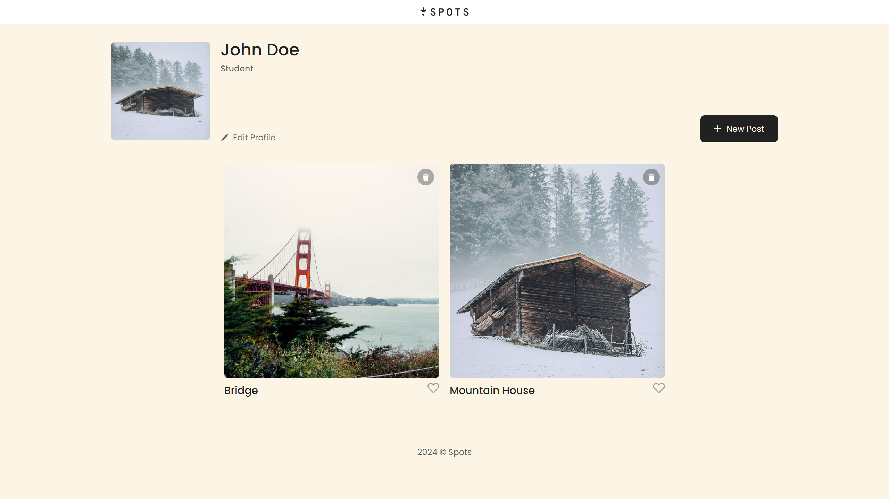
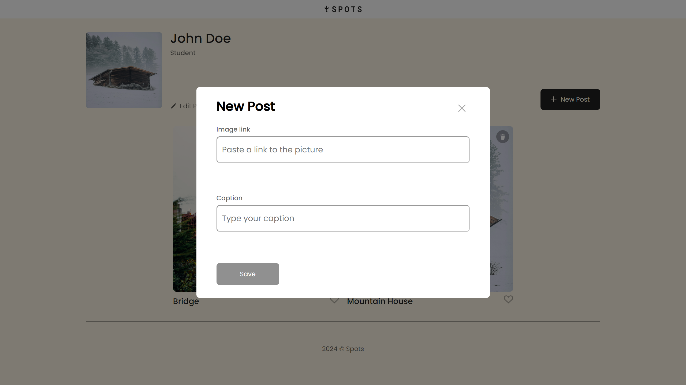
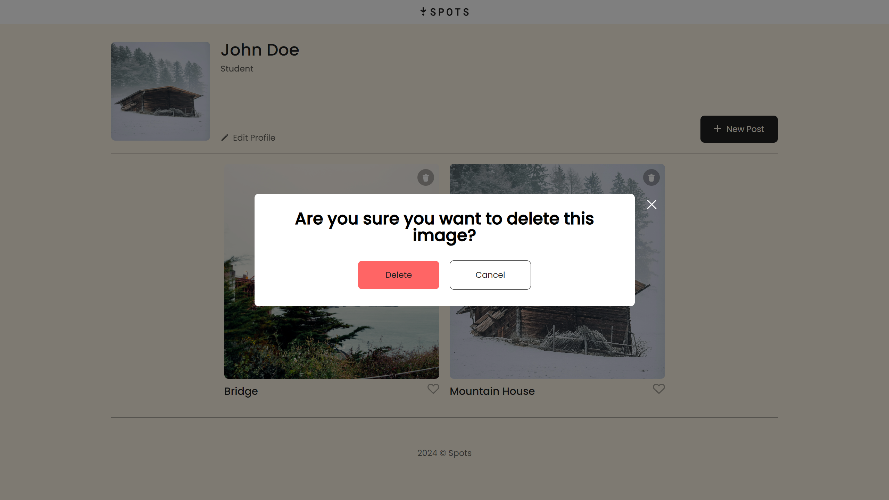

# Spots

### Project Features

- Intro
- Figma
- Images

### Project Description

This project is a basic social media style webpage where users can upload their own photos. The site features the ability to upload photos from a link to create a post or update the avatar photo, as well as add descriptions for posts. The site also includes functionality for adding and removing likes from posts, as well as the ability to delete a post.

### Figma

- [Link to the project on Figma](https://www.figma.com/design/mXGZ6wZ4QPKx5KjpHX9QCV/Sprint-9-Project%3A-Spots?node-id=0-1&node-type=canvas&t=gW0MHKWvA52aI9dX-0)

**Images**

**Video**

https://youtu.be/8rVHYdmravg

**GitHub Pages**

https://tackyjarl.github.io/se_project_spots/
